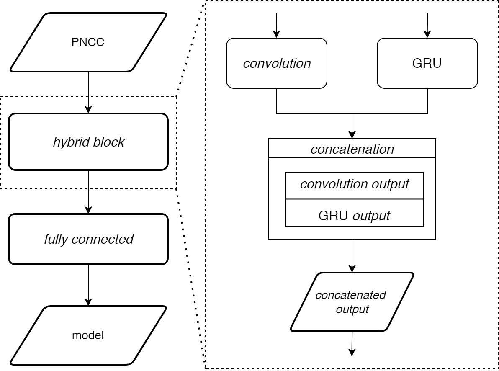
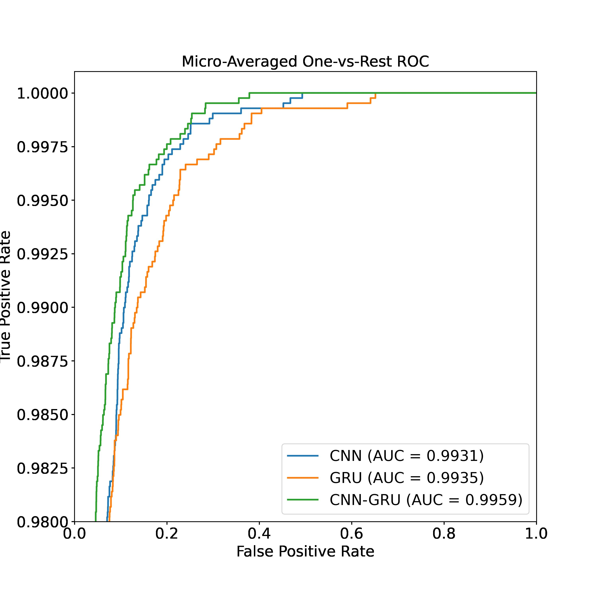

# Power-Law Based Speech Command Recognition using Hybrid CNN-GRU Model
+ Power-Normalized Cepstral Coefficient (PNCC) implementation of the speech command recognition for noisy condition.
+ This repository provides the code for training in python. It also provides trained model in saved/model/, which can be used as a baseline for your own projects.
+ If you are doing cool things with this repository, tell me about it. I am always curious about what you are doing with this code or this task.

---
### Framework:

+ The CNN-GRU Frame structure extracts complex features from the input in the form of PNCC coefficients in parallel.
+ The CNN model extracts spatial information, while the GRU model extracts temporal information from speech signals. 
  + Temporal information on voice signals is represented by a monaural autocorrelation function (ACF) such as center width,
  zero-lag peak, position and relative amplitude of the positive lag peak, duration, tone color, loudness, and pitch.
  + Spatial information on sound signals is represented by the binaural interaural cross-correlation function (IACF) such as the perceptual binaural attribute of binaural LL, sound direction, apparent source width and subjective diffusion.

### Results:

Results which shows the average score of 3-fold cross validation on the [Speech Command Dataset V2](https://www.tensorflow.org/datasets/catalog/speech_commands) with 10 selected class:

 | Model   | Condition | Training Acc (%) | Testing Acc (%) |
|---------|-----------|------------------|-----------------|
 | CNN     | Clean     | 87,91            | 92,34           |
 |         | Noisy     | 83,89            | 84,43           |
 | GRU     | Clean     | 96,90            | 95,95           |
 |         | Noisy     | 92,96            | 89,26           |
 | CNN-GRU | Clean     | 97,80            | 96,48           |
 |         | Noisy     | 95,28            | 89,16           |

* The model are trained with clear audio files and combined audio files with noises and desired SNR were randomly between 0 dB to 20 dB
* The hybrid CNN-GRU model mostly outperform the single model on any condition
* The hybrid CNN-GRU tend to overfit on noisy condition (Still in development stage)

---
### Python dependecies:
+ TensorFlow 2.8.0
+ Librosa 0.9.2
+ Spafe 0.3.1
+ Scikit-learn 1.0.2
+ Numpy 1.21.6

### This work has been published in International Physics Seminar and Reputable Journal, still in the process of publication